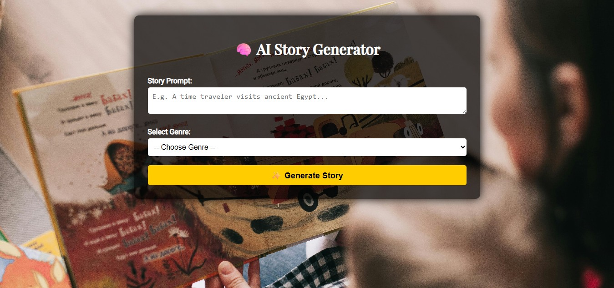
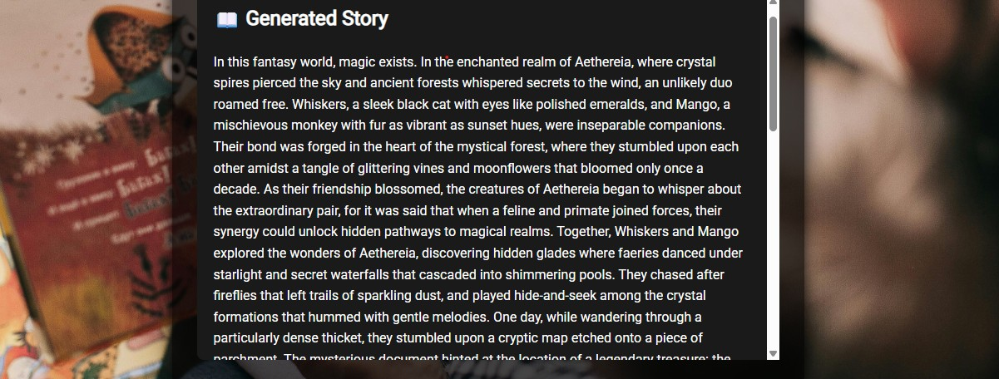

# 🧠 AI Story Generator using IBM Watsonx

This is a web-based AI-powered story generator built using **Flask** and **IBM Watsonx.ai**. Users can input a story prompt and select a genre to generate a creative short story using advanced foundation models like **FLAN-T5-XXL**.

---

## 🚀 Features

- ✍️ Prompt-based story generation
- 🎭 Genre selection (Fantasy, Horror, Sci-Fi, etc.)
- 📚 Story output (3–5 paragraphs)
- 🎨 Styled frontend using HTML & CSS
- 🔐 Secure API keys using `.env` file

---

## 📸 Screenshots

### 🔹 Homepage


### 🔹 Generated Story Output


---

## 🛠️ Tech Stack

- **Backend:** Python + Flask
- **Frontend:** HTML + CSS
- **AI Model:** IBM Watsonx Foundation Model (FLAN-T5-XXL)
- **Environment:** `.env` for secure key storage

---

## 📦 How to Run Locally

### 1️⃣ Clone this repo

```bash
git clone https://github.com/Panitha2908/ai-story-generator.git
cd ai-story-generator
